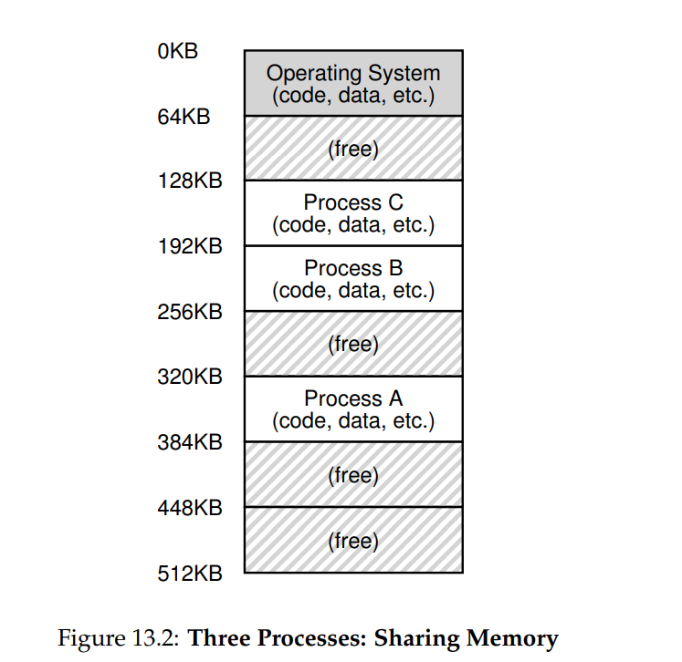
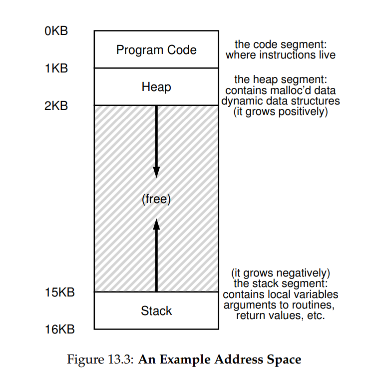

**The Abstraction: Address Spaces**

- However, we have to keep those pesky users in mind, and doing so
  requires the OS to create an easy to use abstraction of physical memory.
  We call this abstraction the address space, and it is the running program’s
  view of memory in the system. Understanding this fundamental OS abstraction of memory is key to understanding how memory is virtualized
- The address space of a process contains all of the memory state of the
  running program. For example, the code of the program (the instructions) have to live in memory somewhere, and thus they are in the address space. The program, while it is running, uses a stack to keep track
  of where it is in the function call chain as well as to allocate local variables
  and pass parameters and return values to and from routines. Finally, the
  heap is used for dynamically-allocated, user-managed memory, such as
  that you might receive from a call to malloc() in C or new in an objectoriented language such as C++ or Java. Of course, there are other things
  in there too (e.g., statically-initialized variables), but for now let us just
  assume those three components: code, stack, and heap. https://www.geeksforgeeks.org/what-is-a-code-in-programming/
  - 

- One major goal of a virtual memory (VM) system is transparency.
  The OS should implement virtual memory in a way that is invisible to
  the running program. Thus, the program shouldn’t be aware of the fact
  that memory is virtualized; rather, the program behaves as if it has its
  own private physical memory. Behind the scenes, the OS (and hardware)
  does all the work to multiplex memory among many different jobs, and
  hence implements the illusion
- Another goal of VM is efficiency. The OS should strive to make the
  virtualization as efficient as possible, both in terms of time (i.e., not making programs run much more slowly) and space (i.e., not using too much
  memory for structures needed to support virtualization). In implementing time-efficient virtualization, the OS will have to rely on hardware
  support, including hardware features such as TLBs (which we will learn
  about in due course).
- Finally, a third VM goal is protection. The OS should make sure to
  protect processes from one another as well as the OS itself from processes. When one process performs a load, a store, or an instruction fetch,
  it should not be able to access or affect in any way the memory contents
  of any other process or the OS itself (that is, anything outside its address
  space). Protection thus enables us to deliver the property of isolation
  among processes; each process should be running in its own isolated cocoon, safe from the ravages of other faulty or even malicious processes.

- TIP: THE PRINCIPLE OF ISOLATION
  Isolation is a key principle in building reliable systems. If two entities are
  properly isolated from one another, this implies that one can fail without affecting the other. Operating systems strive to isolate processes from
  each other and in this way prevent one from harming the other. By using
  memory isolation, the OS further ensures that running programs cannot
  affect the operation of the underlying OS. Some modern OS’s take isolation even further, by walling off pieces of the OS from other pieces of
  the OS. Such microkernels [BH70, R+89, S+03] thus may provide greater
  reliability than typical monolithic kernel designs.
