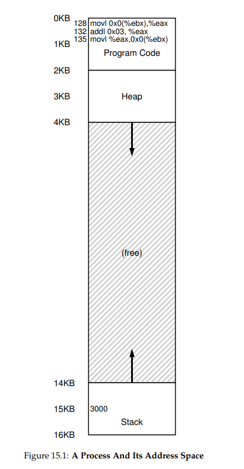
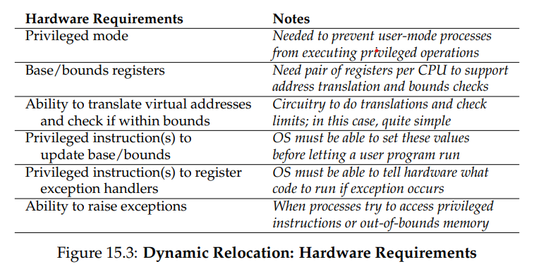
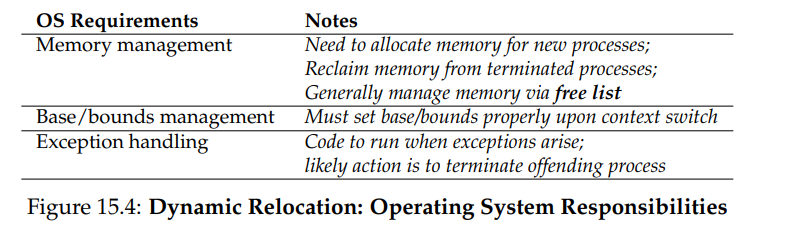
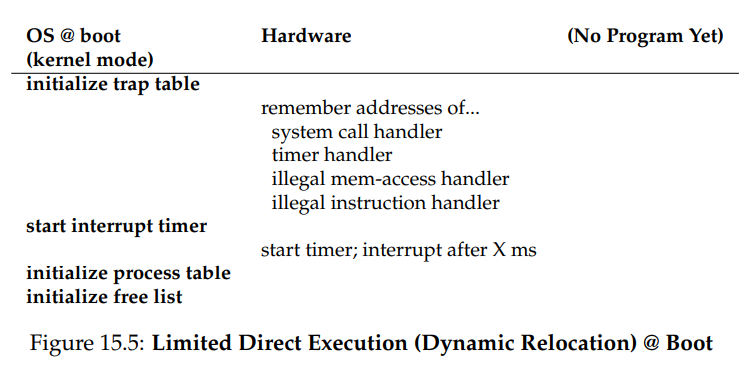
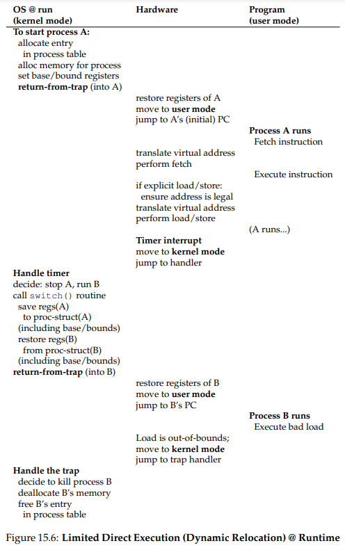

**Mechanism: Address Translation**

- Address translation
  - With address translation, the hardware transforms each
    memory access (e.g., an instruction fetch, load, or store), changing the virtual address provided by the instruction to a physical address where the
    desired information is actually located
  - Specifically, we will assume for now that the user’s address space must
    be placed contiguously in physical memory. We will also assume, for simplicity, that the size of the address space is not too big; specifically, that
    it is less than the size of physical memory. Finally, we will also assume that
    each address space is exactly the same size
- Instructions
  - 128: movl 0x0(%ebx), %eax ;load 0+ebx into eax
    132: addl $0x03, %eax ;add 3 to eax register
    135: movl %eax, 0x0(%ebx) ;store eax back to mem
  - When these instructions run, from the perspective of the process, the
    following memory accesses take place.
    - Fetch instruction at address 128
    - Execute this instruction (load from address 15 KB)
    - Fetch instruction at address 132
    - Execute this instruction (no memory reference)
    - Fetch the instruction at address 135
    - Execute this instruction (store to address 15 KB)
  - `

- Dynamic (Hardware-based) Relocation

  - To gain some understanding of hardware-based address translation,
    we’ll first discuss its first incarnation. Introduced in the first time-sharing
    machines of the late 1950’s is a simple idea referred to as base and bounds;
    the technique is also referred to as dynamic relocation; we’ll use both
    terms interchangeably
  - Specifically, we’ll need two hardware registers within each CPU: one
    is called the base register, and the other the bounds (sometimes called a
    limitregister). This base-and-bounds pair is going to allow us to place the address
    space anywhere we’d like in physical memory, and do so while
    ensuring that the process can only access its own address space
  - Interesting things start to happen when the process is running. Now,
    when any memory reference is generated by the process, it is translated
    by the processor in the following manner:
    - physical address = virtual address + base
  - example: 128: movl 0x0(%ebx), %eax
    - The program counter (PC) is set to 128; when the hardware needs to
      fetch this instruction, it first adds the value to the base register value
      of 32 KB (32768) to get a physical address of 32896; the hardware then
      fetches the instruction from that physical address. Next, the processor
      begins executing the instruction
    - At some point, the process then issues the load from virtual address 15 KB, which the processor takes and again
      adds to the base register (32 KB), getting the final physical address of
      47 KB and thus the desired contents.
    - With dynamic relocation, a little hardware goes a long way. Namely, a
      base register is used to transform virtual addresses (generated by the program) into physical addresses. A bounds (or limit) register ensures that
      such addresses are within the confines of the address space. Together
      they provide a simple and efficient virtualization of memory
  - If a process generates a
    virtual address that is greater than (or equal to) the bounds, or one that
    is negative, the CPU will raise an exception, and the process will likely
    be terminated. The point of the bounds is thus to make sure that all addresses generated by the process are legal and within the “bounds” of the
    process, as you might have guessed.
  - We should note that the base and bounds registers are hardware structures kept on the chip (one pair per CPU). Sometimes people call the
    part of the processor that helps with address translation the memory
    management unit (MMU); as we develop more sophisticated memorymanagement techniques, we will be adding more circuitry to the MMU.
  - 
  - 

  

  

- internal fragmentation
  - the process stack and heap are not too big, all of the space
    between the two is simply wasted
  - the space inside the allocated unit is not all used
    (i.e., is fragmented) and thus wasted
