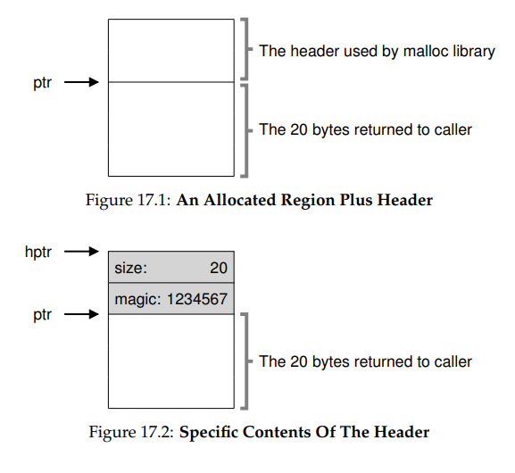
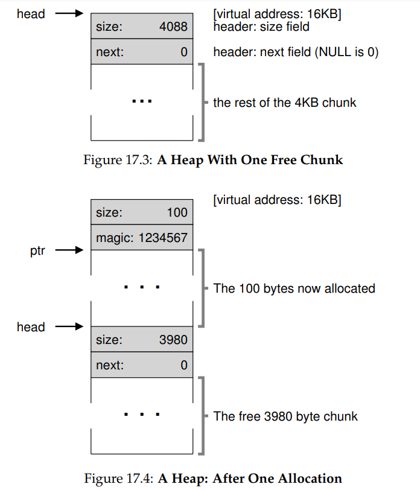

**Free-Space Management**

- Where free-space management becomes more difficult (and interesting) is when the free space you are managing consists of variable-sized
  units; this arises in a user-level memory-allocation library (as in malloc()
  and free()) and in an OS managing physical memory when using segmentation to implement virtual memory. In either case, the problem that
  exists is known as external fragmentation: the free space gets chopped
  into little pieces of different sizes and is thus fragmented; subsequent requests may fail because there is no single contiguous space that can satisfy the request, even though the total amount of free space exceeds the
  size of the request.
- How should free space be managed, when satisfying variable-sized requests? What strategies can be used to minimize fragmentation? What
  are the time and space overheads of alternate approaches?
- Allocators could of course also have the
  problem of internal fragmentation; if an allocator hands out chunks of
  memory bigger than that requested, any unasked for (and thus unused)
  space in such a chunk is considered internal fragmentation (because the
  waste occurs inside the allocated unit) and is another example of space
  waste
- We’ll also assume that once memory is handed out to a client, it cannot
  be relocated to another location in memory. For example, if a program
  calls malloc() and is given a pointer to some space within the heap,
  that memory region is essentially “owned” by the program (and cannot
  be moved by the library) until the program returns it via a corresponding call to free(). Thus, no compaction of free space is possible, which
  would be useful to combat fragmentation2
  . Compaction could, however,
  be used in the OS to deal with fragmentation when implementing segmentation (as discussed in said chapter on segmentation).
- Finally, we’ll assume that the allocator manages a contiguous region
  of bytes. In some cases, an allocator could ask for that region to grow;
  for example, a user-level memory-allocation library might call into the
  kernel to grow the heap (via a system call such as sbrk) when it runs out
  of space. However, for simplicity, we’ll just assume that the region is a
  single fixed size throughout its life.

- The header minimally contains the size of the allocated region (in this
  case, 20); it may also contain additional pointers to speed up deallocation, a magic number to provide additional integrity checking, and other
  information. Let’s assume a simple header which contains the size of the
  region and a magic number, like this:

  - typedef struct {
    int size;
    int magic;
    } header_t;
  - void free(void *ptr) {
    header_t *hptr = (header_t *) ptr - 1;
    - After obtaining such a pointer to the header, the library can easily determine whether the magic number matches the expected value as a sanity check (assert(hptr->magic == 1234567)) and calculate the total size of the newly-freed region via simple math (i.e., adding the size of
      the header to size of the region). Note the small but critical detail in the
      last sentence: the size of the free region is the size of the header plus the
      size of the space allocated to the user. Thus, when a user requests N bytes
      of memory, the library does not search for a free chunk of size N; rather,
      it searches for a free chunk of size N plus the size of the header.
- Now let’s look at some code that initializes the heap and puts the first
  element of the free list inside that space. We are assuming that the heap is
  built within some free space acquired via a call to the system call mmap();
  this is not the only way to build such a heap but serves us well in this
  example. Here is the code:

  - // mmap() returns a pointer to a chunk of free space
    node_t *head = mmap(NULL, 4096, PROT_READ|PROT_WRITE,
    MAP_ANON|MAP_PRIVATE, -1, 0);
    head->size = 4096 - sizeof(node_t);
    head->next = NULL;

  

- Growing The Heap
  - We should discuss one last mechanism found within many allocation libraries. Specifically, what should you do if the heap runs out of space?
    The simplest approach is just to fail. In some cases this is the only option,
    and thus returning NULL is an honorable approach. Don’t feel bad! You
    tried, and though you failed, you fought the good fight
  - Most traditional allocators start with a small-sized heap and then request more memory from the OS when they run out. Typically, this means
    they make some kind of system call (e.g., sbrk in most UNIX systems) to
    grow the heap, and then allocate the new chunks from there. To service
    the sbrk request, the OS finds free physical pages, maps them into the
    address space of the requesting process, and then returns the value of
    the end of the new heap; at that point, a larger heap is available, and the
    request can be successfully serviced.
