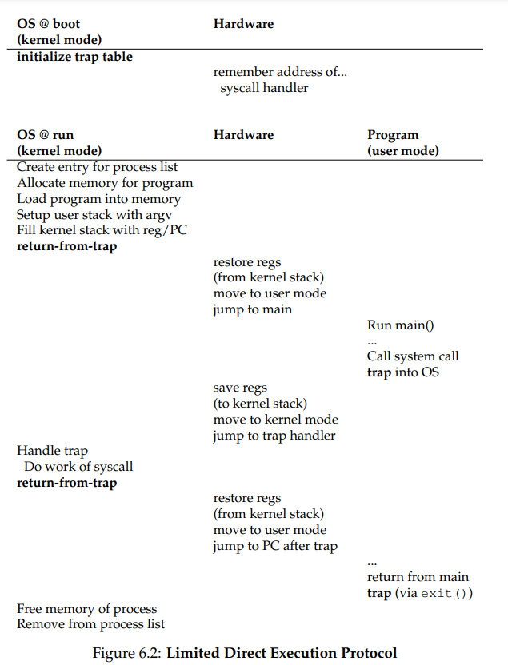
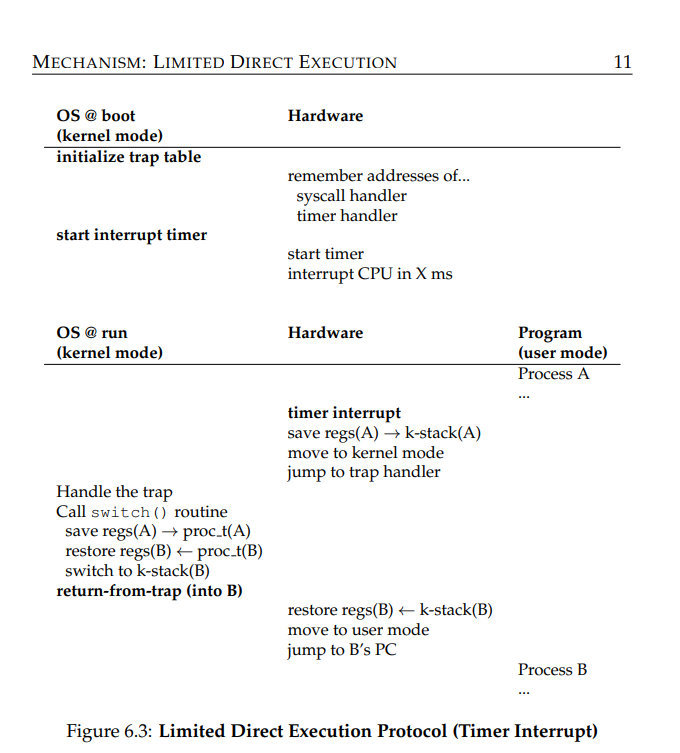
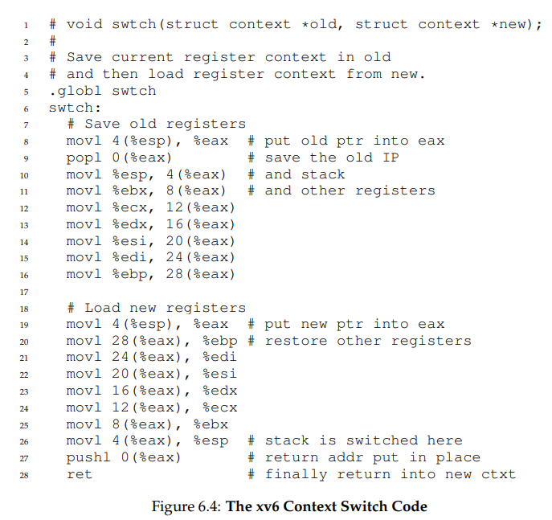

    **Mechanism: Limited Direct Execution**

- HOW TO EFFICIENTLY VIRTUALIZE THE CPU WITH CONTROL:
  - The OS must virtualize the CPU in an efficient manner while retaining
    control over the system. To do so, both hardware and operating-system
    support will be required. The OS will often use a judicious bit of hardware support in order to accomplish its work effectively
- Basic Technique: Limited Direct Execution
  - The “direct execution” part of the idea is simple: just run the
    program directly on the CPU. Thus, when the OS wishes to start a program running, it creates a process entry for it in a process list, allocates
    some memory for it, loads the program code into memory (from disk), locates its entry point (i.e., the main() routine or something similar), jumps
    to it, and starts running the user’s code
    
- ASIDE: WHY SYSTEM CALLS LOOK LIKE PROCEDURE CALLS
  You may wonder why a call to a system call, such as open() or read(),
  looks exactly like a typical procedure call in C; that is, if it looks just like
  a procedure call, how does the system know it’s a system call, and do all
  the right stuff? The simple reason: it is a procedure call, but hidden inside that procedure call is the famous trap instruction. More specifically,
  when you call open() (for example), you are executing a procedure call
  into the C library. Therein, whether for open() or any of the other system calls provided, the library uses an agreed-upon calling convention
  with the kernel to put the arguments to open() in well-known locations
  (e.g., on the stack, or in specific registers), puts the system-call number
  into a well-known location as well (again, onto the stack or a register),
  and then executes the aforementioned trap instruction. The code in the
  library after the trap unpacks return values and returns control to the
  program that issued the system call. Thus, the parts of the C library that
  make system calls are hand-coded in assembly, as they need to carefully
  follow convention in order to process arguments and return values correctly, as well as execute the hardware-specific trap instruction. And now
  you know why you personally don’t have to write assembly code to trap
  into an OS; somebody has already written that assembly for you.
- Thus, the approach we take is to introduce a new processor mode,
  known as user mode; code that runs in user mode is restricted in what it
  can do. For example, when running in user mode, a process can’t issue
  I/O requests; doing so would result in the processor raising an exception;
  the OS would then likely kill the process.
  In contrast to user mode is kernel mode, which the operating system
  (or kernel) runs in. In this mode, code that runs can do what it likes, including privileged operations such as issuing I/O requests and executing
  all types of restricted instructions
- TIP: USE PROTECTED CONTROL TRANSFER
  The hardware assists the OS by providing different modes of execution.
  In user mode, applications do not have full access to hardware resources.
  In kernel mode, the OS has access to the full resources of the machine.
  Special instructions to trap into the kernel and return-from-trap back to
  user-mode programs are also provided, as well as instructions that allow
  the OS to tell the hardware where the trap table resides in memory
- To execute a system call, a program must execute a special trap instruction. This instruction simultaneously jumps into the kernel and raises the
  privilege level to kernel mode; once in the kernel, the system can now perform whatever privileged operations are needed (if allowed), and thus do
  the required work for the calling process. When finished, the OS calls a
  special return-from-trap instruction, which, as you might expect, returns
  into the calling user program while simultaneously reducing the privilege level back to user mode.
- The kernel does so by setting up a trap table at boot time. When the
  machine boots up, it does so in privileged (kernel) mode, and thus is free
  to configure machine hardware as need be. One of the first things the OS
  thus does is to tell the hardware what code to run when certain exceptional events occur. For example, what code should run when a harddisk interrupt takes place, when a keyboard interrupt occurs, or when
  a program makes a system call? The OS informs the hardware of the locations of these trap handlers, usually with some kind of special instruction. Once the hardware is informed, it remembers the location of
  these handlers until the machine is next rebooted, and thus the hardware
  knows what to do (i.e., what code to jump to) when system calls and other
  exceptional events take place.
  
- There are two phases in the limited direct execution (LDE) protocol
  - In the first (at boot time), the kernel initializes the trap table, and the
    CPU remembers its location for subsequent use. The kernel does so via a privileged instruction (all privileged instructions are highlighted in bold)
  - In the second (when running a process), the kernel sets up a few things
    (e.g., allocating a node on the process list, allocating memory) before using a return-from-trap instruction to start the execution of the process;
    this switches the CPU to user mode and begins running the process.
    When the process wishes to issue a system call, it traps back into the OS,
    which handles it and once again returns control via a return-from-trap
    to the process. The process then completes its work, and returns from
    main(); this usually will return into some stub code which will properly
    exit the program (say, by calling the exit() system call, which traps into
    the OS). At this point, the OS cleans up and we are done.
- Timer interrupt
  - A timer device can be programmed to raise an interrupt every
    so many milliseconds; when the interrupt is raised, the currently running
    process is halted, and a pre-configured interrupt handler in the OS runs.
    At this point, the OS has regained control of the CPU, and thus can do
    what it pleases: stop the current process, and start a different one.
  - As we discussed before with system calls, the OS must inform the
    hardware of which code to run when the timer interrupt occurs; thus,
    at boot time, the OS does exactly that. Second, also during the boot
    sequence, the OS must start the timer, which is of course a privileged
    operation. Once the timer has begun, the OS can thus feel safe in that
    control will eventually be returned to it, and thus the OS is free to run
    user programs. The timer can also be turned off (also a privileged operation), something we will discuss later when we understand concurrency
    in more detail.
  - Note that the hardware has some responsibility when an interrupt occurs, in particular to save enough of the state of the program that was
    running when the interrupt occurred such that a subsequent return-fromtrap instruction will be able to resume the running program correctly.
    This set of actions is quite similar to the behavior of the hardware during
    an explicit system-call trap into the kernel, with various registers thus
    getting saved (e.g., onto a kernel stack) and thus easily restored by the
    return-from-trap instruction.

- A natural question you might have is: how long does something like a
  context switch take? Or even a system call? For those of you that are curious, there is a tool called lmbench

ASIDE: KEY CPU VIRTUALIZATION TERMS (MECHANISMS)
• The CPU should support at least two modes of execution: a restricted user mode and a privileged (non-restricted) kernel mode.
• Typical user applications run in user mode, and use a system call
to trap into the kernel to request operating system services.
• The trap instruction saves register state carefully, changes the hardware status to kernel mode, and jumps into the OS to a pre-specified
destination: the trap table.
• When the OS finishes servicing a system call, it returns to the user
program via another specialreturn-from-trap instruction, which reduces privilege and returns control to the instruction after the trap
that jumped into the OS.
• The trap tables must be set up by the OS at boot time, and make
sure that they cannot be readily modified by user programs. All
of this is part of the limited direct execution protocol which runs
programs efficiently but without loss of OS control.
• Once a program is running, the OS must use hardware mechanisms
to ensure the user program does not run forever, namely the timer
interrupt. This approach is a non-cooperative approach to CPU
scheduling.
• Sometimes the OS, during a timer interrupt or system call, might
wish to switch from running the current process to a different one,
a low-level technique known as a context switch.
