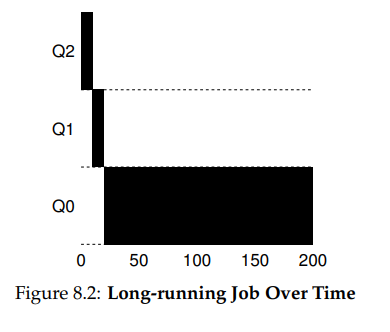
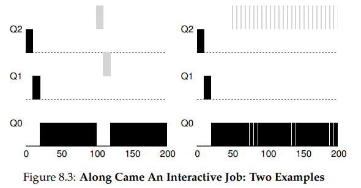
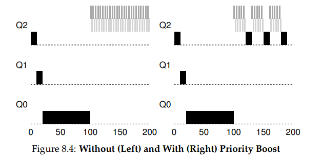
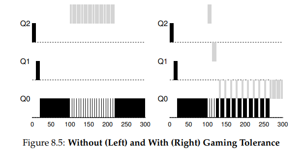

**Scheduling:
The Multi-Level Feedback Queue**

- 
- THE CRUX:
  HOW TO SCHEDULE WITHOUT PERFECT KNOWLEDGE?
  How can we design a scheduler that both minimizes response time for
  interactive jobs while also minimizing turnaround time without a priori
  knowledge of job length?
- MLFQ: Basic Rules

  - In our treatment, the MLFQ has a number of distinct queues, each
    assigned a different priority level. At any given time, a job that is ready
    to run is on a single queue. MLFQ uses priorities to decide which job
    should run at a given time: a job with higher priority (i.e., a job on a
    higher queue) is chosen to run.
  - Of course, more than one job may be on a given queue, and thus have
    the same priority. In this case, we will just use round-robin scheduling
    among those jobs.
  - Thus, we arrive at the first two basic rules for MLFQ:
    - Rule 1: If Priority(A) > Priority(B), A runs (B doesn’t).
    - Rule 2: If Priority(A) = Priority(B), A & B run in RR.
- Attempt #1: How To Change Priority

  - The allotment is the amount of time a job can spend at a given priority
    level before the scheduler reduces its priority. For simplicity, at first, we
    will assume the allotment is equal to a single time slice.
  - Here is our first attempt at a priority-adjustment algorithm:
    - Rule 3: When a job enters the system, it is placed at the highest
      priority (the topmost queue).
    - Rule 4a: If a job uses up its allotment while running, its priority is
      reduced (i.e., it moves down one queue).
    - Rule 4b: If a job gives up the CPU (for example, by performing
      an I/O operation) before the allotment is up, it stays at the same
      priority level (i.e., its allotment is reset).
  - 
  - 
- Problems With Our Current MLFQ

  - First, there is the problem of starvation: if there are “too many” interactive jobs in the system, they will combine to consume all CPU time,
    and thus long-running jobs will never receive any CPU time (they starve).
    We’d like to make some progress on these jobs even in this scenario.
  - Second, a smart user could rewrite their program to game the scheduler. Gaming the scheduler generally refers to the idea of doing something sneaky to trick the scheduler into giving you more than your fair
    share of the resource. The algorithm we have described is susceptible to the following attack: before the allotment is used, issue an I/O operation
    (e.g., to a file) and thus relinquish the CPU; doing so allows you to remain
    in the same queue, and thus gain a higher percentage of CPU time. When
    done right (e.g., by running for 99% of the allotment before relinquishing
    the CPU), a job could nearly monopolize the CPU.
  - Finally, a program may change its behavior over time; what was CPUbound may transition to a phase of interactivity. With our current approach, such a job would be out of luck and not be treated like the other
    interactive jobs in the system.

- Attempt #2: The Priority Boost
  - Rule 5: After some time period S, move all the jobs in the system
    to the topmost queue.
  - 
- Attempt #3: Better Accounting
  - The solution here is to perform better accounting of CPU time at each
    level of the MLFQ. Instead of forgetting how much of its allotment a process used at a given level when it performs I/O, the scheduler should
    keep track; once a process has used its allotment, it is demoted to the next
    priority queue. Whether it uses its allotment in one long burst or many
    small ones should not matter. We thus rewrite Rules 4a and 4b to the
    following single rule
    - Rule 4: Once a job uses up its time allotment at a given level (regardless of how many times it has given up the CPU), its priority is
      reduced (i.e., it moves down one queue).
  - 
- Tuning MLFQ And Other Issues
  - A few other issues arise with MLFQ scheduling. One big question is
    how to parameterize such a scheduler. For example, how many queues
    should there be? How big should the time slice be per queue? The allotment? How often should priority be boosted in order to avoid starvation and account for changes in behavior? There are no easy answers
    to these questions, and thus only some experience with workloads and
    subsequent tuning of the scheduler will lead to a satisfactory balance

- tools: nice, renice, htop, chrt

MLFQ: Summary
We have described a scheduling approach known as the Multi-Level
Feedback Queue (MLFQ). Hopefully you can now see why it is called
that: it has multiple levels of queues, and uses feedback to determine the
priority of a given job. History is its guide: pay attention to how jobs
behave over time and treat them accordingly.
The refined set of MLFQ rules, spread throughout the chapter, are reproduced here for your viewing pleasure:
• Rule 1: If Priority(A) > Priority(B), A runs (B doesn’t).
• Rule 2: If Priority(A) = Priority(B), A & B run in round-robin fashion using the time slice (quantum length) of the given queue.
• Rule 3: When a job enters the system, it is placed at the highest
priority (the topmost queue).
• Rule 4: Once a job uses up its time allotment at a given level (regardless of how many times it has given up the CPU), its priority is
reduced (i.e., it moves down one queue).
• Rule 5: After some time period S, move all the jobs in the system
to the topmost queue.
MLFQ is interesting for the following reason: instead of demanding
a priori knowledge of the nature of a job, it observes the execution of a
job and prioritizes it accordingly. In this way, it manages to achieve the
best of both worlds: it can deliver excellent overall performance (similar
to SJF/STCF) for short-running interactive jobs, and is fair and makes
progress for long-running CPU-intensive workloads. For this reason,
many systems, including BSD UNIX derivatives [LM+89, B86], Solaris
[M06], and Windows NT and subsequent Windows operating systems
[CS97] use a form of MLFQ as their base scheduler.
