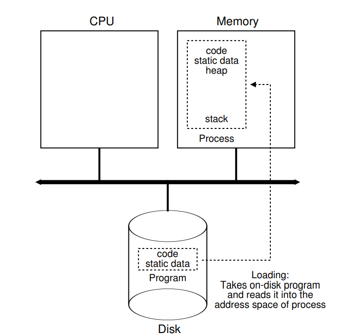
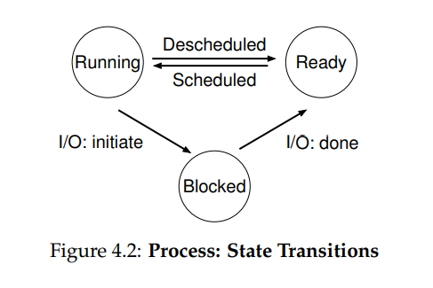
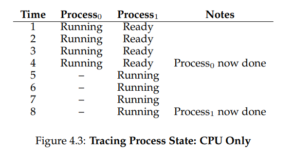
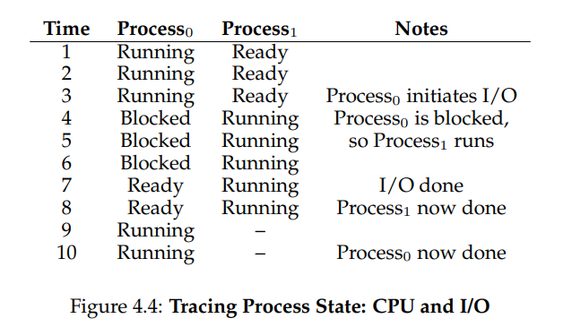

**PROCESSES**

https://www.geeksforgeeks.org/difference-between-operating-system-and-kernel/

- Time sharing is a basic technique used by an OS to share a resource. By
  allowing the resource to be used for a little while by one entity, and then
  a little while by another, and so forth, the resource in question (e.g., the
  CPU, or a network link) can be shared by many. The counterpart of time
  sharing is space sharing, where a resource is divided (in space) among
  those who wish to use it. For example, disk space is naturally a spaceshared resource;
  once a block is assigned to a file, it is normally not assigned to another file until the user deletes the original file.
- The abstraction provided by the OS of a running program is something
  we will call a process
- A  process's state is defined by its allocated memory, the registers it uses, and the I/O resources it accesses.
  There are some particularly special registers that form part of this machine state:

  - the program counter (PC) (sometimes
    called the instruction pointer or IP) tells us which instruction of the program will execute next
  - stack pointer and associated frame pointer are used to manage the stack for function parameters,
    local variables, and return addresses
- Process API

  - Create: An operating system must include some method to create new processes. When you type a command into the shell, or
    double-click on an application icon, the OS is invoked to create a
    new process to run the program you have indicated.
  - Destroy: As there is an interface for process creation, systems also
    provide an interface to destroy processes forcefully. Of course, many
    processes will run and just exit by themselves when complete; when
    they don’t, however, the user may wish to kill them, and thus an interface to halt a runaway process is quite useful.
  - Wait: Sometimes it is useful to wait for a process to stop running;
    thus some kind of waiting interface is often provided.
  - Miscellaneous Control: Other than killing or waiting for a process,
    there are sometimes other controls that are possible. For example,
    most operating systems provide some kind of method to suspend a
    process (stop it from running for a while) and then resume it (continue it running).
  - Status: There are usually interfaces to get some status information
    about a process as well, such as how long it has run for, or what
    state it is in

- A process can be in one of three states:

  - Running: In the running state, a process is running on a processor.
    This means it is executing instructions.
  - Ready: In the ready state, a process is ready to run but for some
    reason the OS has chosen not to run it at this given moment.
  - Blocked: In the blocked state, a process has performed some kind
    of operation that makes it not ready to run until some other event
    takes place. A common example: when a process initiates an I/O
    request to a disk, it becomes blocked and thus some other process
    can use the processor.

- The OS is a program, and like any program, it has some key data structures that track various relevant pieces of information. To track the state
  of each process, for example, the OS likely will keep some kind of process list for all processes that are ready and some additional information to track which process is currently running. The OS must also track,
  in some way, blocked processes; when an I/O event completes, the OS
  should make sure to wake the correct process and ready it to run again.
- You can also see from the figure that there are some other states a process can be in, beyond running, ready, and blocked. Sometimes a system
  will have an initial state that the process is in when it is being created.
  Also, a process could be placed in a final state where it has exited but has not yet been cleaned up (in UNIX-based systems, this is called the
  zombie state1). This final state can be useful as it allows other processes
  (usually the parent that created the process) to examine the return code
  of the process and see if the just-finished process executed successfully
  (usually, programs return zero in UNIX-based systems when they have
  accomplished a task successfully, and non-zero otherwise). When finished, the parent will make one final call (e.g., wait()) to wait for the
  completion of the child, and to also indicate to the OS that it can clean up
  any relevant data structures that referred to the now-extinct process.
- Sometimes people refer to the individual structure that stores information about a process as a Process Control Block
  (PCB), a fancy way of talking about a C structure that contains information about each process (also sometimes called a process descriptor).

ASIDE: KEY PROCESS TERMS

• The process is the major OS abstraction of a running program. At
any point in time, the process can be described by its state: the contents of memory in its address space, the contents of CPU registers
(including the program counter and stack pointer, among others),
and information about I/O (such as open files which can be read or
written).
• The process API consists of calls programs can make related to processes. Typically, this includes creation, destruction, and other useful calls.
• Processes exist in one of many different process states, including
running, ready to run, and blocked. Different events (e.g., getting
scheduled or descheduled, or waiting for an I/O to complete) transition a process from one of these states to the other.
• A process list contains information about all processes in the system. Each entry is found in what is sometimes called a process
control block (PCB), which is really just a structure that contains
information about a specific process.
