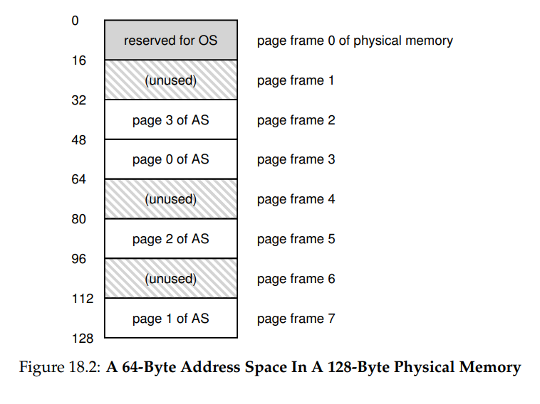
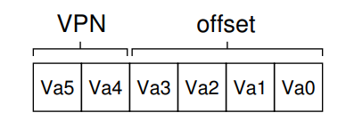
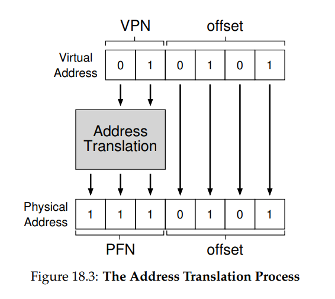
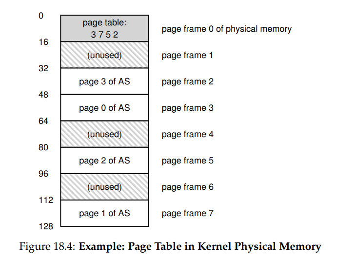
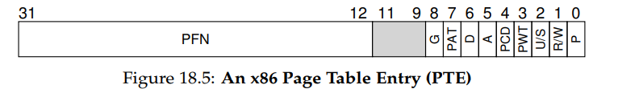
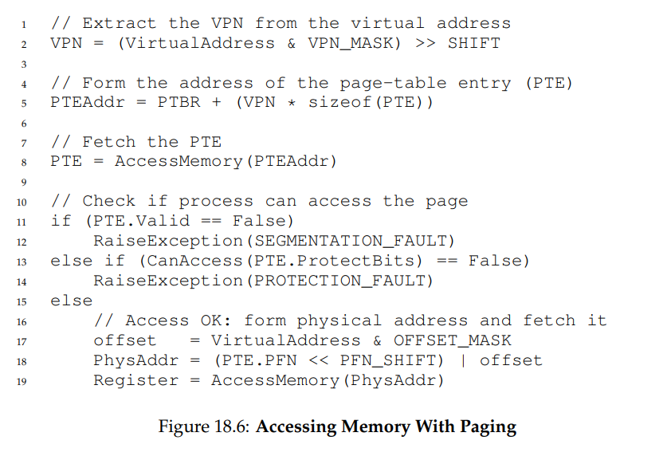

**Paging: Introduction**

- Correspondingly, we view
  physical memory as an array of fixed-sized slots called page frames; each
  of these frames can contain a single virtual-memory page.

In the example, the OS
has placed virtual page 0 of the address space (AS) in physical frame 3,
virtual page 1 of the AS in physical frame 7, page 2 in frame 5, and page
3 in frame 2. Page frames 1, 4, and 6 are currently free.

- To record where each virtual page of the address space is placed in
  physical memory, the operating system usually keeps a per-process data
  structure known as a page table.
  - The major role of the page table is to
    store address translations for each of the virtual pages of the address
    space, thus letting us know where in physical memory each page resides.
    For our simple example (Figure 18.2, page 2), the page table would thus
    have the following four entries: (Virtual Page 0 → Physical Frame 3),
    (VP 1 → PF 7), (VP 2 → PF 5), and (VP 3 → PF 2).
  - It is important to remember that this page table is a per-process data
    structure (most page table structures we discuss are per-process structures; an exception we’ll touch on is the inverted page table). If another
    process were to run in our example above, the OS would have to manage
    a different page table for it, as its virtual pages obviously map to different
    physical pages (modulo any sharing going on).
- movl , %eax
  - Specifically, let’s pay attention to the explicit load of the data from
    address  into the register eax (and thus ignore the
    instruction fetch that must have happened prior).
  - To translate this virtual address that the process generated, we have
    to first split it into two components: the virtual page number (VPN), and
    the offset within the page. For this example, because the virtual address
    space of the process is 64 bytes, we need 6 bits total for our virtual address
    (2
    6 = 64). Thus, our virtual address can be conceptualized as follows:
    
  - In this diagram, Va5 is the highest-order bit of the virtual address, and
    Va0 the lowest-order bit. Because we know the page size (16 bytes), we
    can further divide the virtual address as follows:
    
- When a process generates a virtual address, the OS and hardware
  must combine to translate it into a meaningful physical address. For example, let us assume the load above was to virtual address 21:
  movl 21, %eax
  - Turning “21” into binary form, we get “010101”, and thus we can examine this virtual address and see how it breaks down into a virtual page
    number (VPN) and offset:
    
  - Thus, the virtual address “21” is on the 5th (“0101”th) byte of virtual
    page “01” (or 1). With our virtual page number, we can now index our
    page table and find which physical frame virtual page 1 resides within. In
    the page table above the physical frame number (PFN) (also sometimes
    called the physical page number or PPN) is 7 (binary 111). Thus, we can
    translate this virtual address by replacing the VPN with the PFN and then
    issue the load to physical memory (Figure 18.3).
    
  - 
  - Note the offset stays the same (i.e., it is not translated), because the
    offset just tells us which byte within the page we want. Our final physical
    address is 1110101 (117 in decimal), and is exactly where we want our
    load to fetch data from (Figure 18.2, page 2).
- Where Are Page Tables Stored?
  - Page tables can get terribly large, much bigger than the small segment
    table or base/bounds pair we have discussed previously. For example,
    imagine a typical 32-bit address space, with 4KB pages. This virtual address splits into a 20-bit VPN and 12-bit offset (recall that 10 bits would
    be needed for a 1KB page size, and just add two more to get to 4KB).
  - A 20-bit VPN implies that there are 2
    20 translations that the OS would
    have to manage for each process (that’s roughly a million); assuming we
    need 4 bytes per page table entry (PTE) to hold the physical translation
    plus any other useful stuff, we get an immense 4MB of memory needed
    for each page table! That is pretty large. Now imagine there are 100
    processes running: this means the OS would need 400MB of memory
    just for all those address translations!
  - Because page tables are so big, we don’t keep any special on-chip hardware in the MMU to store the page table of the currently-running process.
    Instead, we store the page table for each process in memory somewhere.
    Let’s assume for now that the page tables live in physical memory that
    the OS manages; later we’ll see that much of OS memory itself can be virtualized, and thus page tables can be stored in OS virtual memory (and
    even swapped to disk), but that is too confusing right now, so we’ll ignore it. In Figure 18.4 (page 5) is a picture of a page table in OS memory;
    see the tiny set of translations in there?
  - One of the most important data structures in the memory management
    subsystem of a modern OS is the page table. In general, a page table
    stores virtual-to-physical address translations, thus letting the system
    know where each page of an address space actually resides in physical
    memory. Because each address space requires such translations, in general there is one page table per process in the system. The exact structure
    of the page table is either determined by the hardware (older systems) or
    can be more flexibly managed by the OS (modern systems).
- What’s Actually In The Page Table?
  - The page table is just
    a data structure that is used to map virtual addresses (or really, virtual
    page numbers) to physical addresses (physical frame numbers)
  - The OS indexes the array by the virtual page
    number (VPN), and looks up the page-table entry (PTE) at that index in
    order to find the desired physical frame number (PFN)
  - As for the contents of each PTE, we have a number of different bits
    in there worth understanding at some level.
    - A valid bit is common to
      indicate whether the particular translation is valid; for example, when
      a program starts running, it will have code and heap at one end of its
      address space, and the stack at the other. All the unused space in-between
      will be marked invalid, and if the process tries to access such memory, it
      will generate a trap to the OS which will likely terminate the process. Thus, the valid bit is crucial for supporting a sparse address space; by
      simply marking all the unused pages in the address space invalid, we
      remove the need to allocate physical frames for those pages and thus save
      a great deal of memory
    - We also might have protection bits, indicating whether the page could
      be read from, written to, or executed from. Again, accessing a page in a
      way not allowed by these bits will generate a trap to the OS.
    - There are a couple of other bits that are important but we won’t talk
      about much for now. A present bit indicates whether this page is in physical memory or on disk (i.e., it has been swapped out). We will understand this machinery further when we study how to swap parts of the
      address space to disk to support address spaces that are larger than physical memory; swapping allows the OS to free up physical memory by
      moving rarely-used pages to disk. A dirty bit is also common, indicating
      whether the page has been modified since it was brought into memory.
    - A reference bit (a.k.a. accessed bit) is sometimes used to track whether
      a page has been accessed, and is useful in determining which pages are
      popular and thus should be kept in memory; such knowledge is critical
      during page replacement, a topic we will study in great detail in subsequent chapters.
    - Figure 18.5 shows an example page table entry from the x86 architecture [I09]. It contains a present bit (P); a read/write bit (R/W) which
      determines if writes are allowed to this page; a user/supervisor bit (U/S)
      which determines if user-mode processes can access the page; a few bits
      (PWT, PCD, PAT, and G) that determine how hardware caching works for
      these pages; an accessed bit (A) and a dirty bit (D); and finally, the page
      frame number (PFN) itself.
    - 
- Paging: Also Too Slow
  - movl 21, %eax
  - Again, let’s just examine the explicit reference to address 21 and not
    worry about the instruction fetch. In this example, we’ll assume the hardware performs the translation for us. To fetch the desired data, the system
    must first translate the virtual address (21) into the correct physical address (117). Thus, before fetching the data from address 117, the system
    must first fetch the proper page table entry from the process’s page table,
    perform the translation, and then load the data from physical memory.
  - To do so, the hardware must know where the page table is for the
    currently-running process. Let’s assume for now that a single page-table
    base register contains the physical address of the starting location of the
    page table. To find the location of the desired PTE, the hardware will thus
    perform the following functions:
    - VPN = (VirtualAddress & VPN_MASK) >> SHIFT
      PTEAddr = PageTableBaseRegister + (VPN * sizeof(PTE))
    - In our example, VPN MASK would be set to 0x30 (hex 30, or binary
      110000) which picks out the VPN bits from the full virtual address; SHIFT
      is set to 4 (the number of bits in the offset), such that we move the VPN
      bits down to form the correct integer virtual page number. For example, with virtual address 21 (010101), and masking turns this value into
      010000; the shift turns it into 01, or virtual page 1, as desired. We then use
      this value as an index into the array of PTEs pointed to by the page table
      base register.
  - Once this physical address is known, the hardware can fetch the PTE
    from memory, extract the PFN, and concatenate it with the offset from the
    virtual address to form the desired physical address. Specifically, you can
    think of the PFN being left-shifted by SHIFT, and then bitwise OR’d with
    the offset to form the final address as follows:
    - offset = VirtualAddress & OFFSET_MASK
      PhysAddr = (PFN << SHIFT) | offset
  - Finally, the hardware can fetch the desired data from memory and put
    it into register eax. The program has now succeeded at loading a value
    from memory!
- To summarize, we now describe the initial protocol for what happens
  on each memory reference. Figure 18.6 (page 9) shows the approach. For
  every memory reference (whether an instruction fetch or an explicit load
  or store), paging requires us to perform one extra memory reference in
  order to first fetch the translation from the page table. That is a lot of work! Extra memory references are costly, and in this case will likely
  slow down the process by a factor of two or more.
  - And now you can hopefully see that there are two real problems that
    we must solve. Without careful design of both hardware and software,
    page tables will cause the system to run too slowly, as well as take up
    too much memory. While seemingly a great solution for our memory
    virtualization needs, these two crucial problems must first be overcome.
  - 

- We have introduced the concept of paging as a solution to our challenge of virtualizing memory. Paging has many advantages over previous approaches (such as segmentation). First, it does not lead to external
  fragmentation, as paging (by design) divides memory into fixed-sized
  units. Second, it is quite flexible, enabling the sparse use of virtual address spaces.
  However, implementing paging support without care will lead to a
  slower machine (with many extra memory accesses to access the page
  table) as well as memory waste (with memory filled with page tables instead of useful application data). We’ll thus have to think a little harder
  to come up with a paging system that not only works, but works well.
  The next two chapters, fortunately, will show us how to do so.
