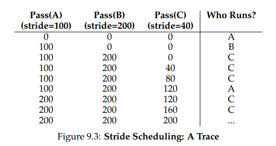

**Scheduling: Proportional Share**

- instead of optimizing for turnaround or response time, a scheduler might instead
  try to guarantee that each job obtain a certain percentage of CPU time.
- Basic Concept: Tickets Represent Your Share

  - Let’s look at an example. Imagine two processes, A and B, and further
    that A has 75 tickets while B has only 25. Thus, what we would like is for
    A to receive 75% of the CPU and B the remaining 25%.
  - Lottery scheduling achieves this probabilistically (but not deterministically) by holding a lottery every so often (say, every time slice). Holding
    a lottery is straightforward: the scheduler must know how many total
    tickets there are (in our example, there are 100).
  - The scheduler then picks a winning ticket, which is a number from 0 to 991
    . Assuming A holds tickets 0 through 74 and B 75 through 99, the winning ticket simply determines whether A or B runs.
    The scheduler then loads the state of that winning process and runs it.
- Ticket Mechanisms

  - Lottery scheduling also provides a number of mechanisms to manipulate tickets in different and sometimes useful ways. One way is with
    the concept of ticket currency. Currency allows a user with a set of tickets to allocate tickets among their own jobs in whatever currency they
    would like; the system then automatically converts said currency into the
    correct global value.
  - For example, assume users A and B have each been given 100 tickets.
    User A is running two jobs, A1 and A2, and gives them each 500 tickets
    (out of 1000 total) in A’s currency. User B is running only 1 job and gives
    it 10 tickets (out of 10 total). The system converts A1’s and A2’s allocation
    from 500 each in A’s currency to 50 each in the global currency; similarly,
    B1’s 10 tickets is converted to 100 tickets. The lottery is then held over the
    global ticket currency (200 total) to determine which job runs.
  - Another useful mechanism is ticket transfer. With transfers, a process
    can temporarily hand off its tickets to another process. This ability is
    especially useful in a client/server setting, where a client process sends
    a message to a server asking it to do some work on the client’s behalf.
    To speed up the work, the client can pass the tickets to the server and
    thus try to maximize the performance of the server while the server is
    handling the client’s request. When finished, the server then transfers the
    tickets back to the client and all is as before.
  - Finally, ticket inflation can sometimes be a useful technique. With
    inflation, a process can temporarily raise or lower the number of tickets
    it owns. Of course, in a competitive scenario with processes that do not
    trust one another, this makes little sense; one greedy process could give
    itself a vast number of tickets and take over the machine. Rather, inflation
    can be applied in an environment where a group of processes trust one
    another; in such a case, if any one process knows it needs more CPU time,
    it can boost its ticket value as a way to reflect that need to the system, all
    without communicating with any other processes.

- Fairness metric
  - F which is simply the time the first job completes divided
    by the time that the second job completes
  - For example, if R = 10, and the first job finishes at time 10 (and the second job at 20),
    F = 10 / 20 = 0.5. When both jobs finish at nearly the same time, F will be quite close to 1.
    In this scenario, that is our goal: a perfectly fair scheduler would achieve F = 1.

- Stride Scheduling
  - Stride scheduling is also straightforward. Each job in the system has
    a stride, which is inverse in proportion to the number of tickets it has. In
    our example above, with jobs A, B, and C, with 100, 50, and 250 tickets,
    respectively, we can compute the stride of each by dividing some large
    number by the number of tickets each process has been assigned. For
    example, if we divide 10,000 by each of those ticket values, we obtain
    the following stride values for A, B, and C: 100, 200, and 40. We call
    this value the stride of each process; every time a process runs, we will
    increment a counter for it (called its pass value) by its stride to track its
    global progress.
  - 
  - So you might be wondering: given the precision of stride scheduling,
    why use lottery scheduling at all? Well, lottery scheduling has one nice
    property that stride scheduling does not: no global state. Imagine a new
    job enters in the middle of our stride scheduling example above; what
    should its pass value be? Should it be set to 0? If so, it will monopolize
    the CPU. With lottery scheduling, there is no global state per process;
    we simply add a new process with whatever tickets it has, update the
    single global variable to track how many total tickets we have, and go
    from there. In this way, lottery makes it much easier to incorporate new
    processes in a sensible manner.

- The Linux Completely Fair Scheduler (CFS)
  - Despite these earlier works in fair-share scheduling, the current Linux
    approach achieves similar goals in an alternate manner. The scheduler,
    entitled the Completely Fair Scheduler (or CFS) [J09], implements fairshare scheduling, but does so in a highly efficient and scalable manner
  - Basic Operation
    - Whereas most schedulers are based around the concept of a fixed time
      slice, CFS operates a bit differently. Its goal is simple: to fairly divide a
      CPU evenly among all competing processes. It does so through a simple
      counting-based technique known as virtual runtime (vruntime)
    - Weighting (Niceness)
      CFS also enables controls over process priority, enabling users or administrators to give some processes a higher share of the CPU. It does this
      not with tickets, but through a classic UNIX mechanism known as the
      nice level of a process. The nice parameter can be set anywhere from -20
      to +19 for a process, with a default of 0. Positive nice values imply lower
      priority and negative values imply higher priority; when you’re too nice,
      you just don’t get as much (scheduling) attention, alas.
    - These weights allow us to compute the effective time slice of each process (as we did before), but now accounting for their priority differences

Summary
We have introduced the concept of proportional-share scheduling and
briefly discussed three approaches: lottery scheduling, stride scheduling,
and the Completely Fair Scheduler (CFS) of Linux. Lottery uses randomness in a clever way to achieve proportional share; stride does so deterministically. CFS, the only “real” scheduler discussed in this chapter, is a
bit like weighted round-robin with dynamic time slices, but built to scale
and perform well under load; to our knowledge, it is the most widely
used fair-share scheduler in existence today.
No scheduler is a panacea, and fair-share schedulers have their fair
share of problems. One issue is that such approaches do not particularly
mesh well with I/O [AC97]; as mentioned above, jobs that perform I/O
occasionally may not get their fair share of CPU. Another issue is that
they leave open the hard problem of ticket or priority assignment, i.e.,
how do you know how many tickets your browser should be allocated, or
to what nice value to set your text editor? Other general-purpose schedulers (such as the MLFQ we discussed previously, and other similar Linux
schedulers) handle these issues automatically and thus may be more easily deployed.
The good news is that there are many domains in which these problems are not the dominant concern, and proportional-share schedulers
are used to great effect. For example, in a virtualized data center (or
cloud), where you might like to assign one-quarter of your CPU cycles
to the Windows VM and the rest to your base Linux installation, proportional sharing can be simple and effective. The idea can also be extended
to other resources; see Waldspurger [W02] for further details on how to
proportionally share memory in VMWare’s ESX Server.
