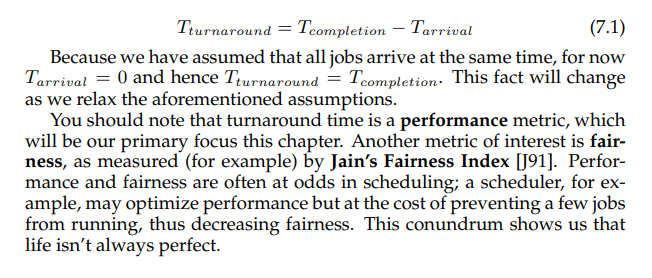
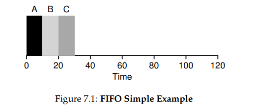
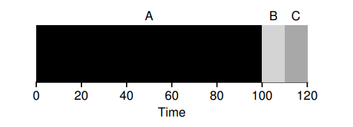
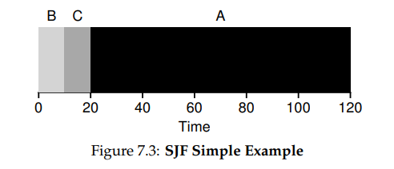
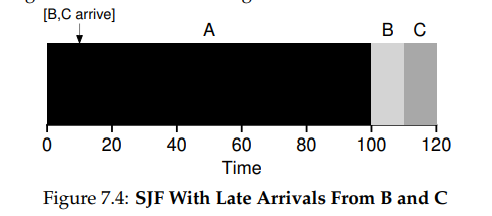
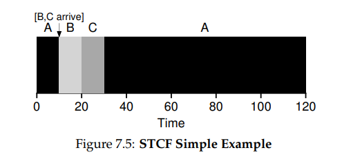
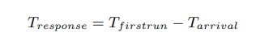
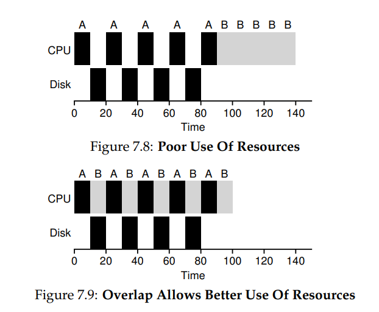

**Scheduling: Introduction**

- THE CRUX: HOW TO DEVELOP SCHEDULING POLICY
  How should we develop a basic framework for thinking about
  scheduling policies? What are the key assumptions? What metrics are
  important? What basic approaches have been used in the earliest of computer systems?
- We will make the following assumptions about the processes, sometimes called jobs, that are running in the system:

1. Each job runs for the same amount of time.
2. All jobs arrive at the same time.
3. Once started, each job runs to completion.
4. All jobs only use the CPU (i.e., they perform no I/O)
5. The run-time of each job is known.

- The turnaround time of a job is defined
  as the time at which the job completes minus the time at which the job
  arrived in the system
  
- First In, First Out (FIFO)

  - Let’s do a quick example together. Imagine three jobs arrive in the
    system, A, B, and C, at roughly the same time (Tarrival = 0). Because
    FIFO has to put some job first, let’s assume that while they all arrived
    simultaneously, A arrived just a hair before B which arrived just a hair
    before C. Assume also that each job runs for 10 seconds. What will the
    average turnaround time be for these jobs?
    
  - A finished at 10, B at 20, and C at 30.
    Thus, the average turnaround time for the three jobs is simply (10+20+30) / 3 = 20.
    Computing turnaround time is as easy as that.
- Now let’s relax one of our assumptions. In particular, let’s relax assumption 1, and thus no longer assume that each job runs for the same
  amount of time. How does FIFO perform now? What kind of workload
  could you construct to make FIFO perform poorly?

  - Job A runs first for the full 100 seconds
    before B or C even get a chance to run. Thus, the average turnaround
    time for the system is high: a painful 110 seconds ( 100+110+120 ) / 3 = 110)

    
- Shortest Job First (SJF)

  - It turns out that a very simple approach solves this problem; in fact
    it is an idea stolen from operations research [C54,PV56] and applied to
    scheduling of jobs in computer systems. This new scheduling discipline
    is known as Shortest Job First (SJF), and the name should be easy to
    remember because it describes the policy quite completely: it runs the
    shortest job first, then the next shortest, and so on.
    
  - Hopefully the diagram makes it clear why SJF performs much better with regards to average turnaround time. Simply by running B and C before A, SJF reduces
    average turnaround from 110 seconds to 50 ( 10+20+120 ) / 3 = 50, more than
    a factor of two improvement.
- Let’s relax another. In particular,
  we can target assumption 2, and now assume that jobs can arrive at any
  time instead of all at once. What problems does this lead to?

  - 
  - Here we can illustrate the problem again with an example. This time,
    assume A arrives at t = 0 and needs to run for 100 seconds, whereas B
    and C arrive at t = 10 and each need to run for 10 seconds.
  - As you can see from the figure, even though B and C arrived shortly
    after A, they still are forced to wait until A has completed, and thus suffer
    the same convoy problem. Average turnaround time for these three jobs
    is 103.33 seconds ( 100+(110−10)+(120−10) ) / 3 ). What can a scheduler do?
- Shortest Time-to-Completion First (STCF)

  - we need to relax assumption 3 (that jobs must
    run to completion), so let’s do that
  - 

- A New Metric: Response Time

  - We define response time as the time from when the job arrives in a
    system to the first time it is scheduled
    
- Round Robin

  - To solve this problem, we will introduce a new scheduling algorithm,
    classically referred to as Round-Robin (RR) scheduling [K64]. The basic
    idea is simple: instead of running jobs to completion, RR runs a job for a
    time slice (sometimes called a scheduling quantum) and then switches
    to the next job in the run queue. It repeatedly does so until the jobs are
    finished. For this reason, RR is sometimes called time-slicing. Note that
    the length of a time slice must be a multiple of the timer-interrupt period;
    thus if the timer interrupts every 10 milliseconds, the time slice could be
    10, 20, or any other multiple of 10 ms
- Making the time slice too short is problematic: suddenly the
  cost of context switching will dominate overall performance. Thus, deciding on the length of the time slice presents a trade-off to a system designer, making it long enough to amortize the cost of switching without
  making it so long that the system is no longer responsive
- TIP: AMORTIZATION CAN REDUCE COSTS
  The general technique of amortization is commonly used in systems
  when there is a fixed cost to some operation. By incurring that cost less
  often (i.e., by performing the operation fewer times), the total cost to the
  system is reduced. For example, if the time slice is set to 10 ms, and the
  context-switch cost is 1 ms, roughly 10% of time is spent context switching and is thus wasted. If we want to amortize this cost, we can increase
  the time slice, e.g., to 100 ms. In this case, less than 1% of time is spent
  context switching, and thus the cost of time-slicing has been amortized.

- More generally, any policy (such as RR) that is fair, i.e., that evenly divides the CPU among active processes on a small time scale, will perform
  poorly on metrics such as turnaround time. Indeed, this is an inherent
  trade-off: if you are willing to be unfair, you can run shorter jobs to completion, but at the cost of response time; if you instead value fairness, response time is lowered, but at the cost of turnaround time. This type of trade-off is common in systems; you can’t have your cake and eat it too.
  - We have developed two types of schedulers. The first type (SJF, STCF)
    optimizes turnaround time, but is bad for response time. The second type
    (RR) optimizes response time but is bad for turnaround. And we still
    have two assumptions which need to be relaxed: assumption 4 (that jobs
    do no I/O), and assumption 5 (that the run-time of each job is known).
    Let’s tackle those assumptions next.

