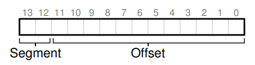
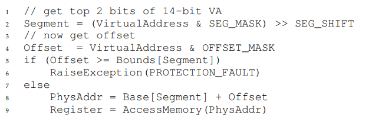

**Segmentation**

- How do we support a large address space with (potentially) a lot of
  free space between the stack and the heap? Note that in our examples,
  with tiny (pretend) address spaces, the waste doesn’t seem too bad. Imagine, however, a 32-bit address space (4 GB in size); a typical program will
  only use megabytes of memory, but still would demand that the entire
  address space be resident in memory.
- Segmentation: Generalized Base/Bounds
  - The idea is simple: instead of having just one base
    and bounds pair in our MMU, why not have a base and bounds pair per
    logical segment of the address space? A segment is just a contiguous
    portion of the address space of a particular length, and in our canonical
    address space, we have three logically-different segments: code, stack,
    and heap. What segmentation allows the OS to do is to place each one
    of those segments in different parts of physical memory, and thus avoid
    filling physical memory with unused virtual address space
- Which Segment Are We Referring To?
  - The hardware uses segment registers during translation. How does it
    know the offset into a segment, and to which segment an address refers?
  - In our example above, we have three segments; thus we need two
    bits to accomplish our task. If we use the top two bits of our 14-bit virtual
    address to select the segment, our virtual address looks like this:
    
  - In our example, then, if the top two bits are 00, the hardware knows
    the virtual address is in the code segment, and thus uses the code base
    and bounds pair to relocate the address to the correct physical location.
    If the top two bits are 01, the hardware knows the address is in the heap,
    and thus uses the heap base and bounds.
    
  - In our running example, we can fill in values for the constants above.
    Specifically, SEG MASK would be set to 0x3000, SEG SHIFT to 12, and
    OFFSET MASK to 0xFFF
  - There are other ways for the hardware to determine which segment
    a particular address is in. In the implicit approach, the hardware determines the segment by noticing how the address was formed.
    If, for example, the address was generated from the program counter (i.e., it was
    an instruction fetch), then the address is within the code segment; if the
    address is based off of the stack or base pointer, it must be in the stack
    segment; any other address must be in the heap.
- The general problem that arises is that physical memory quickly becomes full of little holes of free space, making it difficult to allocate new
  segments, or to grow existing ones. We call this problem external fragmentation
