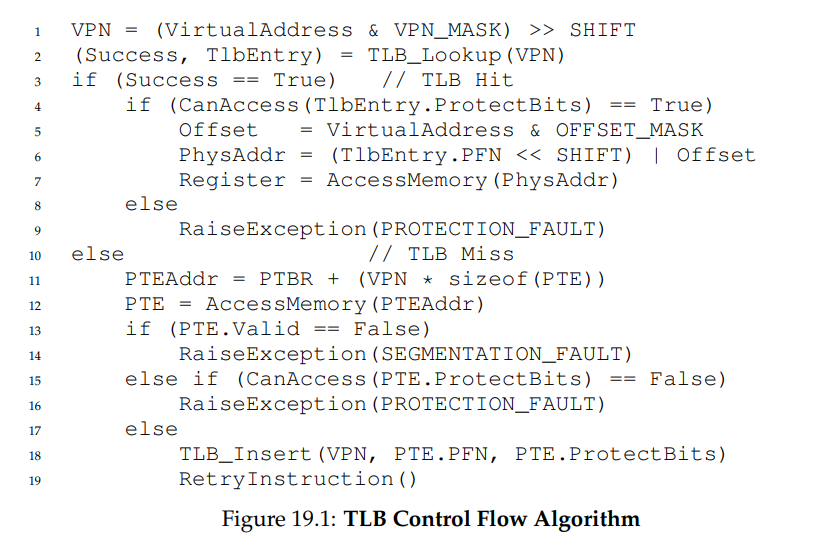
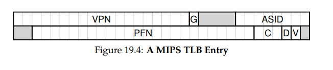

**Paging: Faster Translations (TLBs)**

- How can we speed up address translation, and generally avoid the
  extra memory reference that paging seems to require? What hardware
  support is required? What OS involvement is needed?
- A TLB is part of the chip’s memory-management unit (MMU), and is simply a
  hardware cache of popular virtual-to-physical address translations; thus,
  a better name would be an address-translation cache.

- TIP: USE CACHING WHEN POSSIBLE

  - Caching is one of the most fundamental performance techniques in computer systems, one that is used again and again to make the “commoncase fast” [HP06]. The idea behind hardware caches is to take advantage
    of locality in instruction and data references. There are usually two types
    of locality: temporal locality and spatial locality. With temporal locality,
    the idea is that an instruction or data item that has been recently accessed
    will likely be re-accessed soon in the future. Think of loop variables or instructions in a loop; they are accessed repeatedly over time. With spatial
    locality, the idea is that if a program accesses memory at address x, it will
    likely soon access memory near x. Imagine here streaming through an
    array of some kind, accessing one element and then the next. Of course,
    these properties depend on the exact nature of the program, and thus are
    not hard-and-fast laws but more like rules of thumb.
    Hardware caches, whether for instructions, data, or address translations
    (as in our TLB) take advantage of locality by keeping copies of memory in
    small, fast on-chip memory. Instead of having to go to a (slow) memory
    to satisfy a request, the processor can first check if a nearby copy exists
    in a cache; if it does, the processor can access it quickly (i.e., in a few
    CPU cycles) and avoid spending the costly time it takes to access memory
    (many nanoseconds).
    You might be wondering: if caches (like the TLB) are so great, why don’t
    we just make bigger caches and keep all of our data in them? Unfortunately, this is where we run into more fundamental laws like those of
    physics. If you want a fast cache, it has to be small, as issues like the
    speed-of-light and other physical constraints become relevant. Any large
    cache by definition is slow, and thus defeats the purpose. Thus, we are
    stuck with small, fast caches; the question that remains is how to best use
    them to improve performance.
- Who Handles The TLB Miss?

  - In the olden days,
    the hardware had complex instruction sets (sometimes called CISC, for
    complex-instruction set computers) and the people who built the hardware didn’t much trust those sneaky OS people. Thus, the hardware
    would handle the TLB miss entirely. To do this, the hardware has to
    know exactly where the page tables are located in memory (via a pagetable base register, used in Line 11 in Figure 19.1), as well as their exact
    format; on a miss, the hardware would “walk” the page table, find the correct page-table entry and extract the desired translation, update the TLB
    with the translation, and retry the instruction
    - An example of an “older”
      architecture that has hardware-managed TLBs is the Intel x86 architecture, which uses a fixed multi-level page table; the current page table is pointed to by the CR3 register
    - More modern architectures (e.g., MIPS R10k [H93] or Sun’s SPARC v9
      [WG00], both RISC or reduced-instruction set computers) have what is
      known as a software-managed TLB. On a TLB miss, the hardware simply raises an exception (line 11 in Figure 19.3), which pauses the current
      instruction stream, raises the privilege level to kernel mode, and jumps
      to a trap handler. As you might guess, this trap handler is code within
      the OS that is written with the express purpose of handling TLB misses.
      When run, the code will lookup the translation in the page table, use special “privileged” instructions to update the TLB, and return from the trap;
      at this point, the hardware retries the instruction (resulting in a TLB hit)
- TLB Contents: What’s In There?

  - Let’s look at the contents of the hardware TLB in more detail. A typical
    TLB might have 32, 64, or 128 entries and be what is called fully associative. Basically, this just means that any given translation can be anywhere
    in the TLB, and that the hardware will search the entire TLB in parallel to
    find the desired translation. A TLB entry might look like this:
    - VPN | PFN | other bits
  - Note that both the VPN and PFN are present in each entry, as a translation could end up in any of these locations (in hardware terms, the TLB
    is known as a fully-associative cache). The hardware searches the entries
    in parallel to see if there is a match.
  - More interesting are the “other bits”. For example, the TLB commonly
    has a valid bit, which says whether the entry has a valid translation or
    not. Also common are protection bits, which determine how a page can
    be accessed (as in the page table). For example, code pages might be
    marked read and execute, whereas heap pages might be marked read and
    write. There may also be a few other fields, including an address-space
    identifier, a dirty bit, and so forth; see below for more information.

- A Real TLB Entry
  - This example is from the MIPS
    R4000 [H93], a modern system that uses software-managed TLBs
  - The MIPS R4000 supports a 32-bit address space with 4KB pages. Thus,
    we would expect a 20-bit VPN and 12-bit offset in our typical virtual address. However, as you can see in the TLB, there are only 19 bits for the
    VPN; as it turns out, user addresses will only come from half the address
    space (the rest reserved for the kernel) and hence only 19 bits of VPN
    are needed. The VPN translates to up to a 24-bit physical frame number
    (PFN), and hence can support systems with up to 64GB of (physical) main
    memory (2
    24 4KB pages).
  - There are a few other interesting bits in the MIPS TLB. We see a global
    bit (G), which is used for pages that are globally-shared among processes.
    Thus, if the global bit is set, the ASID is ignored. We also see the 8-bit
    ASID, which the OS can use to distinguish between address spaces (as
    described above). One question for you: what should the OS do if there
    are more than 256 (2^8) processes running at a time? Finally, we see 3
    Coherence (C) bits, which determine how a page is cached by the hardware
    (a bit beyond the scope of these notes); a dirty bit which is marked when
    the page has been written to (we’ll see the use of this later); a valid bit
    which tells the hardware if there is a valid translation present in the entry.
    There is also a page mask field (not shown), which supports multiple page
    sizes; we’ll see later why having larger pages might be useful. Finally,
    some of the 64 bits are unused (shaded gray in the diagram).
  - 
  - MIPS TLBs usually have 32 or 64 of these entries, most of which are
    used by user processes as they run. However, a few are reserved for the
    OS. A wired register can be set by the OS to tell the hardware how many
    slots of the TLB to reserve for the OS; the OS uses these reserved mappings for code and data that it wants to access during critical times, where
    a TLB miss would be problematic (e.g., in the TLB miss handler).
  - Because the MIPS TLB is software managed, there needs to be instructions to update the TLB. The MIPS provides four such instructions: TLBP,
    which probes the TLB to see if a particular translation is in there; TLBR,
    which reads the contents of a TLB entry into registers; TLBWI, which replaces a specific TLB entry; and TLBWR, which replaces a random TLB
    entry. The OS uses these instructions to manage the TLB’s contents. It is
    of course critical that these instructions are privileged; imagine what a
    user process could do if it could modify the contents of the TLB (hint: just
    about anything, including take over the machine, run its own malicious
    “OS”, or even make the Sun disappear).

We have seen how hardware can help us make address translation
faster. By providing a small, dedicated on-chip TLB as an address-translation
cache, most memory references will hopefully be handled without having
to access the page table in main memory. Thus, in the common case, the performance of the program will be almost as if memory isn’t being
virtualized at all, an excellent achievement for an operating system, and
certainly essential to the use of paging in modern systems.
However, TLBs do not make the world rosy for every program that
exists. In particular, if the number of pages a program accesses in a short
period of time exceeds the number of pages that fit into the TLB, the program will generate a large number of TLB misses, and thus run quite a
bit more slowly. We refer to this phenomenon as exceeding the TLB coverage, and it can be quite a problem for certain programs. One solution,
as we’ll discuss in the next chapter, is to include support for larger page
sizes; by mapping key data structures into regions of the program’s address space that are mapped by larger pages, the effective coverage of the
TLB can be increased. Support for large pages is often exploited by programs such as a database management system (a DBMS), which have
certain data structures that are both large and randomly-accessed.
One other TLB issue worth mentioning: TLB access can easily become a bottleneck in the CPU pipeline, in particular with what is called a
physically-indexed cache. With such a cache, address translation has to
take place before the cache is accessed, which can slow things down quite
a bit. Because of this potential problem, people have looked into all sorts
of clever ways to access caches with virtual addresses, thus avoiding the
expensive step of translation in the case of a cache hit. Such a virtuallyindexed cache solves some performance problems, but introduces new
issues into hardware design as well. See Wiggins’s fine survey for more
details [W03].
